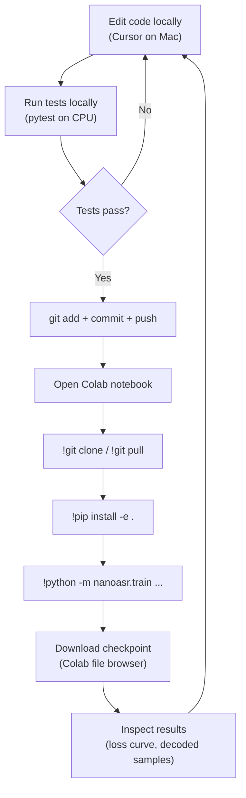
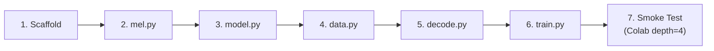
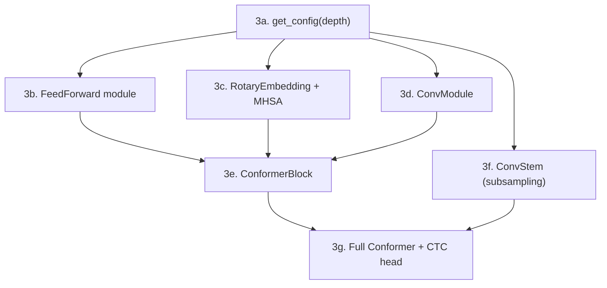
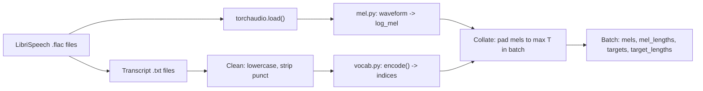

# Phase 1: Minimal Viable Training -- Detailed Implementation Plan

> **Goal**: Get a depth-4 Conformer-CTC model training on LibriSpeech dev-clean in Colab, with loss decreasing and recognizable (if garbled) text coming out of greedy decode. Every component connects end-to-end.

---

## Step 0: Dev Environment Setup

### 0a. Python environment with uv

[uv](https://docs.astral.sh/uv/) is the recommended tool. It replaces pip, venv, pip-tools, and pyenv in a single fast binary. Install it once and use it for everything.

```bash
# Install uv (one-time)
curl -LsSf https://astral.sh/uv/install.sh | sh

# Create the project and virtual environment
cd ~/nanowhisper
uv init --name nano-asr        # creates pyproject.toml if not present
uv venv                        # creates .venv/ in project root
source .venv/bin/activate       # activate (add to your shell profile if desired)

# Install dependencies (editable install of our package)
uv pip install -e ".[dev]"
```

Why uv over conda/pip:
- 10-50x faster installs (Rust-based resolver)
- Handles venvs natively (`uv venv`), no separate tool
- Lockfile support (`uv lock`) for reproducible environments
- Works identically on Mac (local dev) and Linux (Colab) -- no conda environment headaches

**On Colab**, uv is not pre-installed but pip is fine. The Colab environment is ephemeral anyway -- `pip install -e .` is all you need there.

### 0b. Git setup

Initialize the repo and set up a proper .gitignore before writing any code.

```bash
cd ~/nanowhisper
git init
```

**.gitignore** -- critical to get right from the start:

```gitignore
# Python
__pycache__/
*.pyc
*.egg-info/
.venv/
dist/
build/

# Data (LibriSpeech is ~6GB, never commit it)
data/
*.flac
*.wav

# Model checkpoints (can be 10s-100s of MB)
runs/
*.pt
*.onnx
*.mlpackage/
*.mlmodel

# macOS
.DS_Store

# IDE
.vscode/
.idea/

# Colab
*.ipynb_checkpoints/
```

The key rule: **code goes in git, data and models do not.** LibriSpeech, checkpoints, and CoreML packages are downloaded/generated, never committed.

### 0c. Directory structure after setup

```
nanowhisper/
├── .git/
├── .gitignore
├── .venv/                    # local Python env (gitignored)
├── pyproject.toml
├── initial_plan.md           # existing
├── phase1_detailed.md        # existing
├── nanoasr/
│   ├── __init__.py
│   ├── vocab.py
│   ├── mel.py
│   ├── model.py
│   ├── data.py
│   ├── decode.py
│   └── train.py
├── tests/                    # lightweight shape/logic tests
│   ├── test_vocab.py
│   ├── test_mel.py
│   ├── test_model.py
│   └── test_decode.py
├── data/                     # gitignored, created on first run
│   └── LibriSpeech/          # downloaded by torchaudio
└── runs/                     # gitignored, created by train.py
    └── ...                   # checkpoints + metrics
```

### 0d. Local testing strategy (Mac CPU)

Not everything needs a GPU. Here's what runs where:

| Task | Where | Time |
|------|-------|------|
| `vocab.py` unit tests | Mac CPU | instant |
| `mel.py` -- compute spectrogram for one file | Mac CPU | <1s |
| `model.py` -- forward pass shape test (depth=4, batch=2) | Mac CPU | ~2s |
| `data.py` -- load 1 batch from dev-clean | Mac CPU | ~5s (first run downloads ~350MB) |
| `decode.py` -- greedy decode synthetic data | Mac CPU | instant |
| `train.py` -- 1 epoch on dev-clean, depth=4 | Mac CPU | ~15 min (slow but works) |
| `train.py` -- full 50 epochs, depth=4 | **Colab T4** | ~10 min |
| `train.py` -- depth=8+, train-clean-100 | **Colab T4/A100** | hours |

**Rule of thumb**: Write code locally, test shapes/logic locally on CPU, train for real on Colab. You should never need a GPU until you run `train.py` for more than a quick sanity check.

You *can* train depth=4 on Mac CPU to verify the loop works end-to-end, but it's slow. MPS (Apple GPU) works with PyTorch but has quirks with some ops -- not worth debugging in Phase 1.

---

## Development Workflow

### The daily loop (Phase 1)



### Git workflow

Keep it simple. One branch (`main`) for Phase 1. No feature branches until the project has more than one contributor or you're doing risky experiments.

```bash
# After editing locally
git add -A
git commit -m "implement mel.py with torchaudio backend"
git push origin main
```

Commit often, at natural breakpoints:
- After each step (scaffold, mel.py, model.py, etc.) passes its tests
- After fixing a bug found during Colab training
- Before and after any architectural change

Commit messages should be short and describe what changed, not why (the plan docs cover the why). Examples:
- `add vocab.py with 28-token char vocabulary`
- `implement conformer block with macaron FF + MHSA + conv`
- `fix CTC input_lengths: need mel_lengths // 4 not mel_lengths`

### Colab notebook setup

Create a single notebook `nanoasr_train.ipynb` (can live in repo root or in Google Drive -- your choice). It should be minimal:

```python
# Cell 1: Setup (run once per session)
!git clone https://github.com/<you>/nanowhisper.git
%cd nanowhisper
!pip install -e . -q

# Cell 2: Train (run/re-run as needed)
!python -m nanoasr.train \
    --depth 4 \
    --data dev-clean \
    --data-root ./data \
    --epochs 50 \
    --batch-size 8

# Cell 3: (Phase 2+) Evaluate
# !python -m nanoasr.evaluate --checkpoint runs/latest/model.pt --data dev-clean
```

**When you change code locally and want to retrain**:

```python
# In Colab, just pull and reinstall
%cd /content/nanowhisper
!git pull
!pip install -e . -q
# Then re-run the training cell
```

### Getting checkpoints off Colab

Three options, from simplest to most robust:

1. **Colab file browser** (simplest): Click the folder icon in Colab's left sidebar, navigate to `nanowhisper/runs/...`, right-click `model.pt`, download. Works for files <100MB.

2. **Google Drive mount** (for larger files or automation):
   ```python
   from google.colab import drive
   drive.mount('/content/drive')
   !cp runs/latest/model.pt /content/drive/MyDrive/nanoasr_checkpoints/
   ```
   Then access from Mac via Google Drive sync or web.

3. **gdown / direct download** (scripted):
   ```python
   from google.colab import files
   files.download('runs/latest/model.pt')
   ```

For Phase 1, option 1 is fine. Switch to option 2 when checkpoints get large (depth-12 models are ~200MB).

### When to upgrade to Colab Pro

Stay on free tier for Phase 1 and 2. Upgrade when:
- You're training depth-8+ and sessions keep timing out
- You need A100 (16GB T4 VRAM is tight for depth-12 with batch_size=8)
- You want background execution (Pro+ only) so training survives closing your browser

Estimated cost: depth-12 on train-clean-100 takes ~6 hours on A100. At Pro pricing that's roughly one session.

---

## Testing Best Practices

### Test files

Create lightweight test files that run on CPU in seconds. These are your safety net -- run them before every push.

```
tests/
├── test_vocab.py       # encode/decode roundtrip, edge cases
├── test_mel.py         # shape check, no NaN, normalize works
├── test_model.py       # forward pass shapes at depth 4/8/12
└── test_decode.py      # greedy decode on synthetic logprobs
```

### What to test (and what not to)

**Do test** (these catch real bugs):
- Tensor shapes at every stage of the pipeline
- `input_lengths` after ConvStem downsampling match what CTC expects
- Greedy decode produces correct output on hand-crafted logprobs
- `log_softmax` output actually sums to 1 in probability space
- Text cleaning handles edge cases (punctuation, numbers, unicode)
- Collate function produces correct lengths for variable-length batches

**Don't test** (waste of time in Phase 1):
- Model convergence (that's what Colab training is for)
- Exact numerical outputs (too brittle, changes with random seed)
- torchaudio internals (trust the library)
- Training speed / performance

### Running tests

```bash
# Run all tests (should complete in <10 seconds on CPU)
python -m pytest tests/ -v

# Run a single test file
python -m pytest tests/test_model.py -v

# Run with print output visible (useful for shape debugging)
python -m pytest tests/ -v -s
```

### Example test: test_model.py

```python
import torch
from nanoasr.model import Conformer, get_config

def test_forward_pass_depth4():
    config = get_config(4)
    model = Conformer(config)
    mel = torch.randn(2, 80, 500)
    log_probs = model(mel)
    assert log_probs.shape == (2, 125, 28)
    # Verify log_softmax: exp should sum to ~1
    assert torch.allclose(log_probs.exp().sum(dim=-1),
                          torch.ones(2, 125), atol=1e-5)

def test_forward_pass_depth8():
    config = get_config(8)
    model = Conformer(config)
    mel = torch.randn(2, 80, 500)
    log_probs = model(mel)
    assert log_probs.shape == (2, 125, 28)

def test_param_count_depth4():
    config = get_config(4)
    model = Conformer(config)
    n = sum(p.numel() for p in model.parameters())
    assert 1_000_000 < n < 5_000_000  # ~2M expected

def test_variable_length_input():
    config = get_config(4)
    model = Conformer(config)
    # Different time lengths in same call should work
    for T in [100, 500, 1000, 3000]:
        mel = torch.randn(1, 80, T)
        log_probs = model(mel)
        assert log_probs.shape[1] == T // 4
        assert log_probs.shape[2] == 28
```

---

## Implementation Order

The order below is deliberate. Each step produces something testable before moving on. Never write more than one file without testing.



---

## Step 1: Project Scaffolding

### Files

- `pyproject.toml`
- `nanoasr/__init__.py`
- `nanoasr/vocab.py`

### pyproject.toml

```toml
[project]
name = "nano-asr"
version = "0.1.0"
requires-python = ">=3.10"
dependencies = [
    "torch>=2.1",
    "torchaudio>=2.1",
]

[project.optional-dependencies]
export = ["coremltools>=7.0", "onnx"]
dev = ["pytest", "matplotlib"]
```

No HuggingFace, no SpeechBrain, no NeMo, no librosa. Only torch and torchaudio.

### nanoasr/vocab.py (~15 lines)

Centralize the vocabulary so every module imports from one place.

```python
VOCAB = list("abcdefghijklmnopqrstuvwxyz ") + ["<blank>"]
BLANK_IDX = 27
VOCAB_SIZE = 28

char_to_idx = {c: i for i, c in enumerate(VOCAB)}
idx_to_char = {i: c for i, c in enumerate(VOCAB)}

def encode(text: str) -> list[int]:
    """Convert cleaned text to list of token indices."""
    return [char_to_idx[c] for c in text if c in char_to_idx]

def decode_indices(indices: list[int]) -> str:
    """Convert token indices back to string (no CTC collapse, just raw map)."""
    return "".join(idx_to_char.get(i, "") for i in indices if i != BLANK_IDX)
```

### How to test

```bash
python -c "from nanoasr.vocab import encode, VOCAB_SIZE; print(VOCAB_SIZE); print(encode('hello world'))"
# Should print: 28, [7, 4, 11, 11, 14, 26, 22, 14, 17, 11, 3]
```

---

## Step 2: mel.py -- Mel Spectrogram

### Purpose

Convert raw audio waveform to log-mel spectrogram. This is the model's input representation -- pure signal processing, no learned parameters.

### Spec

```
Input:  waveform tensor, shape [num_samples], 16kHz mono float32
Output: log-mel spectrogram, shape [80, T] where T = num_samples // 160
```

### Parameters

| Parameter | Value | Rationale |
|-----------|-------|-----------|
| Sample rate | 16,000 Hz | Standard for speech |
| FFT size (n_fft) | 400 | 25ms window at 16kHz |
| Hop length | 160 | 10ms hop at 16kHz |
| Mel bins | 80 | Standard for ASR (Whisper, Parakeet all use 80) |
| Freq range | 0 - 8000 Hz | Nyquist = 8kHz for 16kHz audio |
| Log floor | 1e-6 | Numerical stability for log |

### Implementation approach

Use `torchaudio.transforms.MelSpectrogram` for v1. Wrap it in a function that also does log scaling and normalization.

```python
import torch
import torchaudio

class MelSpectrogramTransform:
    def __init__(self, sample_rate=16000, n_fft=400, hop_length=160,
                 n_mels=80, f_max=8000):
        self.transform = torchaudio.transforms.MelSpectrogram(
            sample_rate=sample_rate,
            n_fft=n_fft,
            hop_length=hop_length,
            n_mels=n_mels,
            f_max=f_max,
        )

    def __call__(self, waveform: torch.Tensor) -> torch.Tensor:
        """waveform: [num_samples] -> log_mel: [80, T]"""
        mel = self.transform(waveform)        # [80, T]
        log_mel = torch.log(mel + 1e-6)       # log scale
        log_mel = (log_mel - log_mel.mean()) / (log_mel.std() + 1e-6)  # per-utterance norm
        return log_mel
```

### Key design decisions

- **Per-utterance normalization** (not global stats): simpler, no need to precompute dataset statistics. Good enough for v1.
- **Not an nn.Module**: no parameters, no gradients. It's a function/callable, not part of the model graph. This matters for CoreML export later -- mel stays on CPU, model goes to Neural Engine.
- **torchaudio backend**: using the built-in transform rather than rolling our own STFT + filterbank. The educational from-scratch version (~50 lines with `torch.stft` + manual mel matrix) is a good follow-up, but for Phase 1 correctness and speed matter more.

### Shape walkthrough for a 5-second clip

```
Audio: 5.0 seconds at 16kHz = 80,000 samples
       waveform shape: [80000]

After MelSpectrogram:
       n_fft=400, hop=160 -> T = 80000 // 160 = 500 frames
       mel shape: [80, 500]

After log + normalize:
       log_mel shape: [80, 500]  (same shape, just different values)
```

### How to test

Write a quick test that loads an actual LibriSpeech audio file (or any .wav/.flac) and checks:
1. Output shape is `[80, T]` where `T ~= num_samples / 160`
2. Output has roughly zero mean and unit variance (per-utterance norm)
3. Output does not contain NaN or Inf
4. Visually plot a spectrogram with matplotlib to sanity check (should show formant structure for speech)

```python
import torchaudio
waveform, sr = torchaudio.load("some_speech.flac")
assert sr == 16000  # or resample
mel_fn = MelSpectrogramTransform()
log_mel = mel_fn(waveform.squeeze(0))
print(log_mel.shape)  # [80, T]
assert not torch.isnan(log_mel).any()
```

---

## Step 3: model.py -- Conformer Encoder + CTC Head

This is the largest file (~300 lines) and the core of the project. Build it bottom-up: small modules first, compose into the full model, test shapes at every step.

### Implementation order within model.py



### 3a. Config from depth

```python
from dataclasses import dataclass

@dataclass
class ConformerConfig:
    depth: int
    d_model: int
    n_heads: int
    n_layers: int
    conv_kernel: int = 31
    ff_mult: int = 4
    dropout: float = 0.1
    vocab_size: int = 28

def get_config(depth: int) -> ConformerConfig:
    return ConformerConfig(
        depth=depth,
        d_model=depth * 32,
        n_heads=depth,
        n_layers=depth,
    )
```

Test: `get_config(4)` should give `d_model=128, n_heads=4, n_layers=4`.

### 3b. FeedForward module

```
LayerNorm(d_model)
-> Linear(d_model, d_model * ff_mult)
-> SiLU
-> Dropout
-> Linear(d_model * ff_mult, d_model)
-> Dropout
```

Used with 0.5 residual scale (Macaron-style half-step).

```python
class FeedForward(nn.Module):
    def __init__(self, d_model, ff_mult=4, dropout=0.1):
        ...
        self.norm = nn.LayerNorm(d_model)
        self.w1 = nn.Linear(d_model, d_model * ff_mult)
        self.w2 = nn.Linear(d_model * ff_mult, d_model)
        self.dropout = nn.Dropout(dropout)

    def forward(self, x):
        # x: [B, T, d_model]
        out = self.norm(x)
        out = self.w1(out)
        out = F.silu(out)
        out = self.dropout(out)
        out = self.w2(out)
        out = self.dropout(out)
        return out
```

Shape: `[B, T, d_model]` in, `[B, T, d_model]` out. No shape change.

### 3c. Multi-Head Self-Attention with Rotary Embeddings

**Rotary Position Embeddings (RoPE)**: Apply rotation to Q and K before attention. This gives relative position information without position embedding parameters.

```python
class RotaryEmbedding(nn.Module):
    def __init__(self, dim, max_len=8192):
        ...
        # Precompute sin/cos tables of shape [max_len, dim]
        # dim should be head_dim (= d_model / n_heads = 32 for all depths)

    def forward(self, x, offset=0):
        # x: [B, n_heads, T, head_dim]
        # Apply rotation to pairs of dimensions
        ...
```

**MHSA module**:

```python
class MultiHeadSelfAttention(nn.Module):
    def __init__(self, d_model, n_heads, dropout=0.1):
        ...
        self.norm = nn.LayerNorm(d_model)
        self.qkv = nn.Linear(d_model, 3 * d_model)  # fused QKV projection
        self.out_proj = nn.Linear(d_model, d_model)
        self.rope = RotaryEmbedding(d_model // n_heads)
        self.dropout = nn.Dropout(dropout)

    def forward(self, x, mask=None):
        # x: [B, T, d_model]
        B, T, _ = x.shape
        out = self.norm(x)
        q, k, v = self.qkv(out).chunk(3, dim=-1)
        q = q.view(B, T, self.n_heads, self.head_dim).transpose(1, 2)
        k = k.view(B, T, self.n_heads, self.head_dim).transpose(1, 2)
        v = v.view(B, T, self.n_heads, self.head_dim).transpose(1, 2)

        q = self.rope(q)
        k = self.rope(k)

        # Use PyTorch's scaled_dot_product_attention (Flash Attention when available)
        attn_out = F.scaled_dot_product_attention(q, k, v, attn_mask=mask)
        attn_out = attn_out.transpose(1, 2).contiguous().view(B, T, self.d_model)
        return self.dropout(self.out_proj(attn_out))
```

Shape: `[B, T, d_model]` in, `[B, T, d_model]` out. No shape change.

Key detail: `F.scaled_dot_product_attention` automatically uses Flash Attention on CUDA when available (Colab T4/A100). No manual kernel selection needed.

### 3d. Convolution Module

The signature Conformer component -- local pattern capture via depthwise convolution.

```
LayerNorm(d_model)
-> Pointwise Conv1d(d_model, 2 * d_model)   # expand
-> GLU(dim=1)                                # gate back to d_model
-> Depthwise Conv1d(d_model, d_model, kernel=31, groups=d_model, padding=15)
-> BatchNorm1d(d_model)
-> SiLU
-> Pointwise Conv1d(d_model, d_model)        # project back
-> Dropout
```

```python
class ConvModule(nn.Module):
    def __init__(self, d_model, conv_kernel=31, dropout=0.1):
        ...
        self.norm = nn.LayerNorm(d_model)
        self.pw_conv1 = nn.Conv1d(d_model, 2 * d_model, 1)
        self.dw_conv = nn.Conv1d(d_model, d_model, conv_kernel,
                                  padding=conv_kernel // 2, groups=d_model)
        self.bn = nn.BatchNorm1d(d_model)
        self.pw_conv2 = nn.Conv1d(d_model, d_model, 1)
        self.dropout = nn.Dropout(dropout)

    def forward(self, x):
        # x: [B, T, d_model]
        out = self.norm(x)
        out = out.transpose(1, 2)            # [B, d_model, T] for Conv1d
        out = self.pw_conv1(out)             # [B, 2*d_model, T]
        out = F.glu(out, dim=1)              # [B, d_model, T]
        out = self.dw_conv(out)              # [B, d_model, T]
        out = self.bn(out)                   # [B, d_model, T]
        out = F.silu(out)
        out = self.pw_conv2(out)             # [B, d_model, T]
        out = self.dropout(out)
        return out.transpose(1, 2)           # [B, T, d_model]
```

Shape: `[B, T, d_model]` in and out. The Conv1d ops need `[B, C, T]` format -- transpose in/out.

**Gotcha**: `BatchNorm1d` needs batch size > 1 during training. In eval mode it uses running stats, so batch size 1 is fine. This means: don't try to train with batch_size=1.

### 3e. ConformerBlock

Compose the submodules in Macaron order:

```python
class ConformerBlock(nn.Module):
    def __init__(self, d_model, n_heads, conv_kernel=31, ff_mult=4, dropout=0.1):
        ...
        self.ff1 = FeedForward(d_model, ff_mult, dropout)
        self.attn = MultiHeadSelfAttention(d_model, n_heads, dropout)
        self.conv = ConvModule(d_model, conv_kernel, dropout)
        self.ff2 = FeedForward(d_model, ff_mult, dropout)
        self.final_norm = nn.LayerNorm(d_model)

    def forward(self, x, mask=None):
        # x: [B, T, d_model]
        x = x + 0.5 * self.ff1(x)       # half-step FF
        x = x + self.attn(x, mask=mask)  # full-step MHSA
        x = x + self.conv(x)             # full-step conv
        x = x + 0.5 * self.ff2(x)       # half-step FF
        x = self.final_norm(x)
        return x
```

### 3f. ConvStem (subsampling)

Reduce time dimension by 4x before the Conformer blocks. This makes attention feasible (750 frames instead of 3000 for 30s audio).

```python
class ConvStem(nn.Module):
    def __init__(self, d_model):
        ...
        self.conv1 = nn.Conv2d(1, d_model, kernel_size=3, stride=2, padding=1)
        self.conv2 = nn.Conv2d(d_model, d_model, kernel_size=3, stride=2, padding=1)
        # After 2x stride-2: freq dim 80 -> 20, time dim T -> T//4
        self.proj = nn.Linear(d_model * 20, d_model)

    def forward(self, x):
        # x: [B, 80, T] (mel spectrogram)
        x = x.unsqueeze(1)              # [B, 1, 80, T]
        x = F.relu(self.conv1(x))       # [B, d_model, 40, T//2]
        x = F.relu(self.conv2(x))       # [B, d_model, 20, T//4]
        B, C, F_dim, T = x.shape
        x = x.permute(0, 3, 1, 2)      # [B, T//4, d_model, 20]
        x = x.reshape(B, T, C * F_dim) # [B, T//4, d_model * 20]
        x = self.proj(x)               # [B, T//4, d_model]
        return x
```

**Shape walkthrough (depth=4, 5-second audio)**:
```
Input mel:                [B, 80, 500]
After unsqueeze:          [B, 1, 80, 500]
After conv1 (stride 2):  [B, 128, 40, 250]
After conv2 (stride 2):  [B, 128, 20, 125]
After permute+reshape:    [B, 125, 2560]     (128 * 20 = 2560)
After linear proj:        [B, 125, 128]
```

So 500 frames become 125 frames (4x reduction). The model sees 125 time steps for 5 seconds of audio.

### 3g. Full Model

```python
class Conformer(nn.Module):
    def __init__(self, config: ConformerConfig):
        ...
        self.stem = ConvStem(config.d_model)
        self.blocks = nn.ModuleList([
            ConformerBlock(config.d_model, config.n_heads,
                          config.conv_kernel, config.ff_mult, config.dropout)
            for _ in range(config.n_layers)
        ])
        self.ctc_head = nn.Linear(config.d_model, config.vocab_size)

    def forward(self, mel, mel_lengths=None):
        # mel: [B, 80, T]
        x = self.stem(mel)                    # [B, T//4, d_model]

        # Create padding mask if lengths provided
        mask = None  # TODO: derive from mel_lengths

        for block in self.blocks:
            x = block(x, mask=mask)

        logits = self.ctc_head(x)             # [B, T//4, vocab_size]
        log_probs = F.log_softmax(logits, dim=-1)
        return log_probs                      # [B, T//4, 28]
```

### How to test model.py

Test each component individually, then the full model:

```python
# Test full forward pass shapes
config = get_config(4)
model = Conformer(config)
mel = torch.randn(2, 80, 500)  # batch of 2, 5 seconds each
log_probs = model(mel)
print(log_probs.shape)  # should be [2, 125, 28]
assert log_probs.shape == (2, 125, 28)

# Test that log_probs sum to ~1 (they're log_softmax)
probs = log_probs.exp()
print(probs.sum(dim=-1).mean())  # should be ~1.0

# Count parameters
n_params = sum(p.numel() for p in model.parameters())
print(f"depth=4: {n_params:,} parameters")  # should be ~2M
```

Run these shape tests for depth 4, 8, 12 to verify the scaling works.

---

## Step 4: data.py -- LibriSpeech Loading

### Purpose

Load LibriSpeech audio + transcripts, compute mel spectrograms, collate into padded batches. Keep it simple for Phase 1 -- no augmentation, no fancy sampling.

### Data flow



### Implementation

```python
class LibriSpeechDataset(torch.utils.data.Dataset):
    def __init__(self, root, split="dev-clean", download=True):
        self.dataset = torchaudio.datasets.LIBRISPEECH(
            root=root, url=split, download=download
        )
        self.mel_transform = MelSpectrogramTransform()

    def __getitem__(self, idx):
        waveform, sample_rate, transcript, _, _, _ = self.dataset[idx]
        assert sample_rate == 16000
        log_mel = self.mel_transform(waveform.squeeze(0))  # [80, T]
        text = clean_text(transcript)  # lowercase, strip punctuation
        tokens = encode(text)          # list of ints
        return log_mel, torch.tensor(tokens, dtype=torch.long)

    def __len__(self):
        return len(self.dataset)
```

### Collate function (critical for CTC)

CTC loss needs exact lengths. Padding must be tracked carefully.

```python
def collate_fn(batch):
    """Pad mels and targets to max length in batch."""
    mels, targets = zip(*batch)

    mel_lengths = torch.tensor([m.shape[1] for m in mels])   # original T for each
    target_lengths = torch.tensor([len(t) for t in targets])

    # Pad mels: [80, T] -> [80, T_max]
    mels_padded = torch.nn.utils.rnn.pad_sequence(
        [m.T for m in mels], batch_first=True  # pad along T dimension
    ).permute(0, 2, 1)  # [B, 80, T_max]

    # Pad targets
    targets_padded = torch.nn.utils.rnn.pad_sequence(
        targets, batch_first=True, padding_value=0
    )  # [B, S_max]

    return mels_padded, mel_lengths, targets_padded, target_lengths
```

**Important**: After the ConvStem's 4x downsampling, the effective input lengths for CTC loss are `mel_lengths // 4`. The training loop must compute this.

### Text cleaning

```python
import re

def clean_text(text: str) -> str:
    text = text.lower()
    text = re.sub(r"[^a-z ]", "", text)  # keep only a-z and space
    text = re.sub(r" +", " ", text)      # collapse multiple spaces
    return text.strip()
```

### How to test

```python
ds = LibriSpeechDataset(root="./data", split="dev-clean")
mel, tokens = ds[0]
print(f"mel: {mel.shape}, tokens: {tokens.shape}")  # e.g. mel: [80, 312], tokens: [42]

# Test collation
loader = DataLoader(ds, batch_size=4, collate_fn=collate_fn)
mels, mel_lens, targets, target_lens = next(iter(loader))
print(f"batch mels: {mels.shape}")  # [4, 80, T_max]
print(f"mel lengths: {mel_lens}")   # e.g. [312, 287, 445, 198]
```

---

## Step 5: decode.py -- Greedy CTC Decoding

### Implementation

This is the simplest file. ~15-20 lines of actual logic.

```python
from nanoasr.vocab import BLANK_IDX, idx_to_char

def greedy_decode(log_probs: torch.Tensor) -> str:
    """
    Greedy CTC decode for a single utterance.

    Args:
        log_probs: [T, vocab_size] log probabilities from model

    Returns:
        Decoded string
    """
    indices = log_probs.argmax(dim=-1).tolist()  # [T] -> list of ints
    decoded = []
    prev = None
    for idx in indices:
        if idx != BLANK_IDX and idx != prev:
            decoded.append(idx_to_char[idx])
        prev = idx
    return "".join(decoded)


def greedy_decode_batch(log_probs: torch.Tensor, lengths: torch.Tensor) -> list[str]:
    """Decode a batch. log_probs: [B, T, vocab_size], lengths: [B]."""
    results = []
    for i in range(log_probs.shape[0]):
        results.append(greedy_decode(log_probs[i, :lengths[i]]))
    return results
```

### The CTC collapse algorithm explained

```
Raw model output indices: [blank, blank, h, h, blank, e, e, e, blank, l, l, l, l, blank, blank, o]
Step 1 - remove blanks:   [h, h, e, e, e, l, l, l, l, o]
Step 2 - collapse dupes:  [h, e, l, o]
Result: "helo"  (not "hello" -- CTC can't produce double letters without blank between them)
```

This means the model must learn to insert blanks between repeated characters. For "hello" the model needs to output something like: `h, blank, e, blank, l, blank, l, blank, o`. This is a known CTC behavior, not a bug.

### How to test

```python
# Synthetic test
fake_logprobs = torch.zeros(10, 28)
# Set up: blank, blank, h(7), h(7), blank, i(8), blank, blank, blank, blank
fake_logprobs[0, 27] = 10  # blank
fake_logprobs[1, 27] = 10  # blank
fake_logprobs[2, 7] = 10   # h
fake_logprobs[3, 7] = 10   # h
fake_logprobs[4, 27] = 10  # blank
fake_logprobs[5, 8] = 10   # i
fake_logprobs[6, 27] = 10  # blank
fake_logprobs[7, 27] = 10  # blank
fake_logprobs[8, 27] = 10  # blank
fake_logprobs[9, 27] = 10  # blank
result = greedy_decode(fake_logprobs)
assert result == "hi", f"Got '{result}'"
```

---

## Step 6: train.py -- Training Loop

### CLI interface

```bash
python -m nanoasr.train --depth 4 --data dev-clean --epochs 50 --batch-size 8 --lr 1e-4
```

All arguments should have sensible defaults derived from `--depth`.

### Training loop structure

```python
def main():
    args = parse_args()
    config = get_config(args.depth)

    # Derived hyperparams
    lr = args.lr or (3e-4 * args.depth / 12)
    device = "cuda" if torch.cuda.is_available() else "cpu"

    # Data
    train_ds = LibriSpeechDataset(root=args.data_root, split=args.data)
    train_loader = DataLoader(train_ds, batch_size=args.batch_size,
                              shuffle=True, collate_fn=collate_fn,
                              num_workers=2, pin_memory=True)

    # Model
    model = Conformer(config).to(device)
    print(f"Model: {sum(p.numel() for p in model.parameters()):,} parameters")

    # Optimizer + scheduler
    optimizer = torch.optim.AdamW(model.parameters(), lr=lr, weight_decay=0.01)
    total_steps = len(train_loader) * args.epochs
    warmup_steps = total_steps // 10

    ctc_loss_fn = torch.nn.CTCLoss(blank=BLANK_IDX, zero_infinity=True)

    # Training loop
    step = 0
    for epoch in range(args.epochs):
        model.train()
        epoch_loss = 0.0

        for mels, mel_lengths, targets, target_lengths in train_loader:
            mels = mels.to(device)
            targets = targets.to(device)

            log_probs = model(mels)  # [B, T//4, 28]
            input_lengths = mel_lengths // 4  # account for ConvStem downsampling

            # CTC loss expects [T, B, C]
            loss = ctc_loss_fn(
                log_probs.permute(1, 0, 2),  # [T, B, 28]
                targets,
                input_lengths,
                target_lengths
            )

            optimizer.zero_grad()
            loss.backward()
            optimizer.step()

            # Learning rate warmup (linear)
            if step < warmup_steps:
                for pg in optimizer.param_groups:
                    pg["lr"] = lr * (step + 1) / warmup_steps

            step += 1
            epoch_loss += loss.item()

            if step % 50 == 0:
                print(f"step {step} | loss {loss.item():.4f} | lr {optimizer.param_groups[0]['lr']:.2e}")

        avg_loss = epoch_loss / len(train_loader)
        print(f"epoch {epoch+1}/{args.epochs} | avg_loss {avg_loss:.4f}")

        # Decode a few examples to see progress
        model.eval()
        with torch.no_grad():
            sample_mels, sample_mel_lens, sample_targets, sample_target_lens = next(iter(train_loader))
            sample_log_probs = model(sample_mels.to(device))
            sample_input_lens = sample_mel_lens // 4
            predictions = greedy_decode_batch(sample_log_probs.cpu(), sample_input_lens)
            for i in range(min(3, len(predictions))):
                ref = decode_indices(sample_targets[i][:sample_target_lens[i]].tolist())
                print(f"  REF: {ref}")
                print(f"  HYP: {predictions[i]}")
                print()

    # Save checkpoint
    checkpoint = {
        "model_state_dict": model.state_dict(),
        "config": config,
        "step": step,
        "epoch": args.epochs,
    }
    save_path = f"model_depth{args.depth}.pt"
    torch.save(checkpoint, save_path)
    print(f"Saved checkpoint to {save_path}")
```

### Key details to get right

**CTC loss input format**: This is the most common source of bugs. `torch.nn.CTCLoss` expects:
- `log_probs`: shape `[T, B, C]` (time-first, NOT batch-first)
- `targets`: shape `[B, S]` or concatenated 1D tensor
- `input_lengths`: shape `[B]` -- **number of valid time steps after ConvStem**, not the original mel length
- `target_lengths`: shape `[B]` -- number of characters in each transcript

**The input_lengths trap**: If `mel_lengths` are the original frame counts, then after ConvStem (4x downsample), `input_lengths = mel_lengths // 4`. If these are wrong, CTC loss will either NaN or produce garbage. This is the single most important thing to get right.

**Warmup**: Linear warmup for the first 10% of steps. Without warmup, CTC loss frequently explodes in early training. The learning rate starts at 0 and linearly increases to the target LR.

### Expected training behavior (depth=4, dev-clean)

```
step 50  | loss 4.2xxx   (CTC loss starts high -- ~log(28) = 3.33 is random)
step 200 | loss 2.5xxx   (model starts learning silence/common letters)
step 500 | loss 1.5xxx   (recognizable fragments appear)
step 1000| loss 0.8xxx   (most common words partially correct)
...
epoch 50 | avg_loss 0.3  (overfitting to dev-clean, but that's fine for Phase 1)
```

If loss stays above 4.0 after 200 steps or goes to NaN, debug checklist:
1. Check `input_lengths` are correct (mel_lengths // 4, NOT mel_lengths)
2. Check `log_probs` are actual log probabilities (log_softmax output)
3. Check `input_lengths >= target_lengths` for every sample (CTC requirement)
4. Check learning rate is not too high (try 1e-4 fixed)

---

## Phase 1 Validation: The Smoke Test

After all files are implemented, run this on Colab:

```bash
# Install
pip install -e .

# Download dev-clean (~350MB) and train depth=4
python -m nanoasr.train --depth 4 --data dev-clean --epochs 50 --batch-size 8

# Expected: ~10-15 min on T4, final loss < 1.0
# Decoded samples should show recognizable words mixed with errors
```

### Success criteria for Phase 1

1. Loss decreases monotonically after warmup (no NaN, no explosion)
2. After 50 epochs on dev-clean, greedy decode produces recognizable English words (even if WER is 60-80%)
3. Checkpoint saves and loads correctly
4. Forward pass shapes are correct at all depths (4, 8, 12)
5. Total Python code is under 600 lines across all files

### What NOT to do in Phase 1

- No SpecAugment (Phase 3)
- No mixed precision (Phase 3)
- No gradient clipping (Phase 3, though add it sooner if you see instability)
- No evaluation metrics / WER (Phase 2)
- No run directory structure (Phase 2)
- No inference CLI (Phase 2)
- No multi-GPU / DDP (Phase 3+)
- No train-clean-100 (Phase 3)

---

## Quick Reference: Common Commands

```bash
# === Local Mac (development) ===

# Activate environment
cd ~/nanowhisper && source .venv/bin/activate

# Install after changing pyproject.toml
uv pip install -e ".[dev]"

# Run all tests
python -m pytest tests/ -v

# Run a single module's tests
python -m pytest tests/test_model.py -v -s

# Quick shape sanity check (no tests needed)
python -c "
from nanoasr.model import Conformer, get_config
import torch
m = Conformer(get_config(4))
print(m(torch.randn(2, 80, 500)).shape)
"

# Git push to trigger Colab sync
git add -A && git commit -m 'your message' && git push

# === Colab (training) ===

# First time in a session
!git clone https://github.com/<you>/nanowhisper.git
%cd nanowhisper
!pip install -e . -q

# Pull latest changes
%cd /content/nanowhisper
!git pull && pip install -e . -q

# Train
!python -m nanoasr.train --depth 4 --data dev-clean --epochs 50 --batch-size 8

# Check GPU
!nvidia-smi
```

## Troubleshooting Checklist

| Symptom | Likely cause | Fix |
|---------|-------------|-----|
| CTC loss is NaN | `input_lengths` wrong | Verify `input_lengths = mel_lengths // 4`, not `mel_lengths` |
| CTC loss stuck at ~3.3 | Model outputting uniform distribution | Check that gradients flow (no detached tensors), LR not too low |
| CTC loss explodes | LR too high or no warmup | Add linear warmup, reduce LR to 1e-4 |
| `RuntimeError: Expected target size...` | Target longer than input | Check `input_lengths >= target_lengths` for all samples; very long transcripts with short audio |
| `BatchNorm` error with batch_size=1 | BatchNorm needs >1 sample | Use batch_size >= 2 (8 recommended) |
| Shape mismatch in ConvStem | Frequency dim math wrong | Verify `d_model * 20` in `proj` layer matches actual freq dim after 2x stride-2 |
| Greedy decode outputs empty string | All predictions are blank | Normal in early training; model hasn't learned yet. Wait for loss to drop below ~2.5 |
| Out of memory on T4 | Batch too large or sequences too long | Reduce batch_size, or filter out very long utterances (>20s) |
| `import nanoasr` fails | Not installed in editable mode | Run `pip install -e .` or `uv pip install -e .` |
